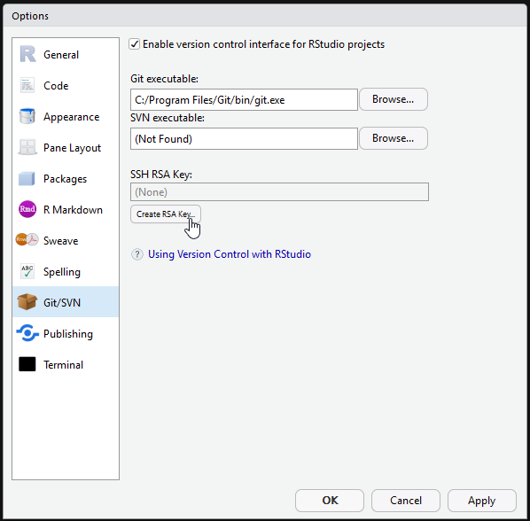
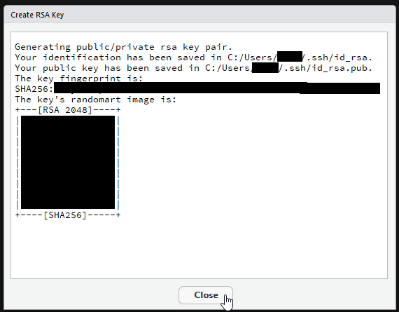
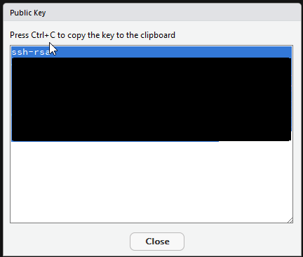
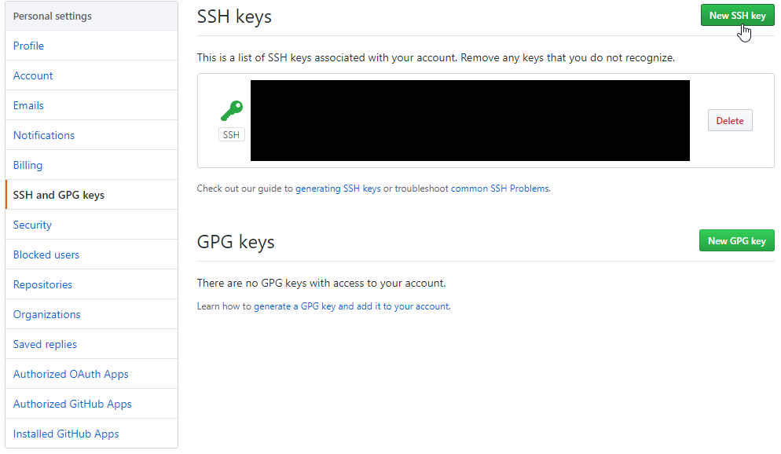
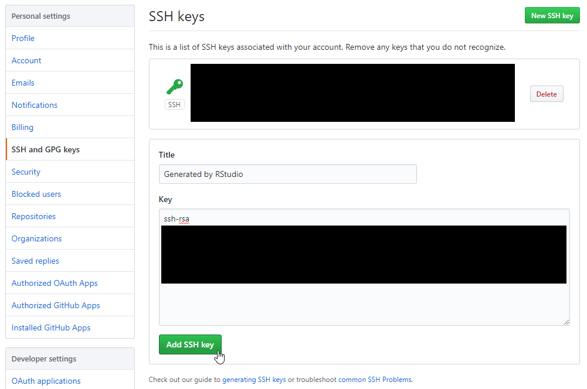
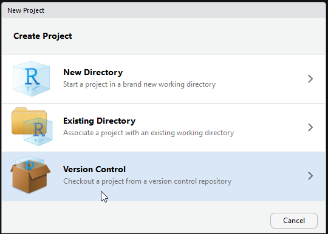
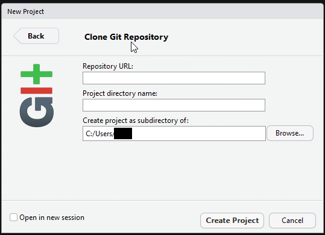
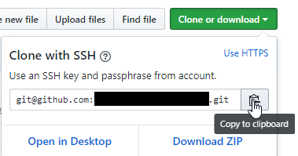
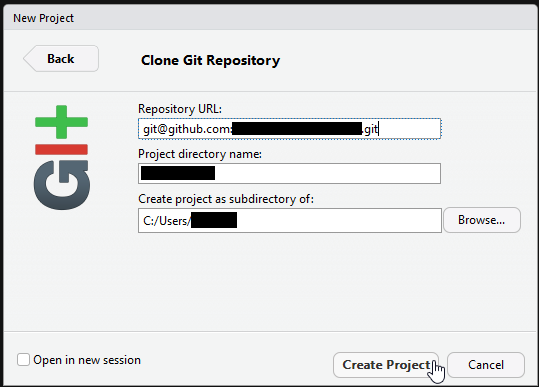
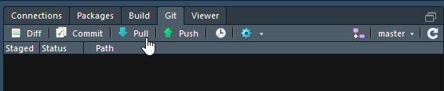

# RStudio & GitHub

This is a very simple tutorial that allows you to configure RStudio and obtain
code from GitHub - it is not a comprehensive Git tutorial.


## 1. Install

- Git from [git-scm.com](https://git-scm.com/downloads)
- R from [CRAN](https://cran.r-project.org/)
- RStudio IDE desktop from [RStudio](https://www.rstudio.com/products/rstudio/download)
  + it is OK to install other packages required by RStudio

### Checks

- RStudio IDE > Options > General should display the R version used
- RStudio IDE > Options > Git/SVN should identify the **Git executable**
- On **OS X Sierra** you might see a dialog box asking to install Xcode. Let it install it,
but be sure to change the path to the `git` executable for both RStudio and Terminal.
  + For RStudio: point the git executable to `/usr/local/git/bin/git`
  + For Terminal: please follow the instructions at the [bottom of this page](https://modulesunraveled.com/installing-git/installing-git-if-you-do-not-have-xcode-or-command-line-developer-tools-installed)

#### Optional tools

- if on Windows, [RTools](https://cran.r-project.org/bin/windows/Rtools/)
- if on Windows or OSX and making extensive use of git, [SourceTree](https://www.sourcetreeapp.com/)


## 2. Configure Remote Repository 

### GitHub

- Create your own GitHub account
  + optionally, enable 2FA and test logging in


## 3. Setup Keys

**Note:** If you are already familiar with RSA Keys and have generated your key,
you may skip these steps

### RStudio IDE > Options > Git/SVN  > Create RSA Key



Do not generate a new key if RStudio finds one!




Note the location (folder) of the files and the name of the files (id_rsa). 
There are two keys / files: the public one (`id_rsa.pub`) is OK to share. 
The private key (`id_rsa`) should always be kept private.

On OS X, you might have to run the following commands to configure the `~/.ssh/` dir:

```
chmod 700 ~/.ssh
chmod 400 ~/.ssh/id_rsa
chmod 400 ~/.ssh/id_rsa.pub
```

Test connection to GitHub with: `ssh -T git@github.com`


## 4. Add Public Key to GitHub

### RStudio IDE > Options > Git/SVN > View Public Key




Copy the Public Key to the Clipboard

### Go to: GitHub > Settings > SSH and GPG keys



### Add SSH Key to GitHub




## 5. Clone RStudio Project

### RStudio IDE > File > New Project ... > Version Control > Git 



Select Git, it should look like this:



### Go to: GitHub > project repository > get link

Select "Clone with SSH" then copy to Clipboard the `git@github...` link.



### Copy and Paste the link into RStudio dialog box

The Project directory name should be populated automatically. 
You should select the parent folder. 




### Press [Create Project]

If the RSA keys are not configured correctly, you will see an error message.
`Permission denied (publickey)`

If successful, RStudio will open the new project and in the **Files** panel
you will see the project files. This is your *local repository*.

You will also see a **Git** panel 
(empty at the beginning) where you can pull, commit and push code changes.


## 6. Update your local files

If you want to keep your *local repository* up to date, you need to **Pull**
code from the *remote repository (GitHub)*.


### RStudio IDE > Git panel > press **Pull**



Please notice that on the top-right side the Git panel display the "branch",
in this case `master`.

**Note:** If you just want to view new code using Pull should be sufficient.
If you make any changes you should discard them before using Pull. 


**For making changes, merging and pushing please see a more advanced 
Git tutorial.**
